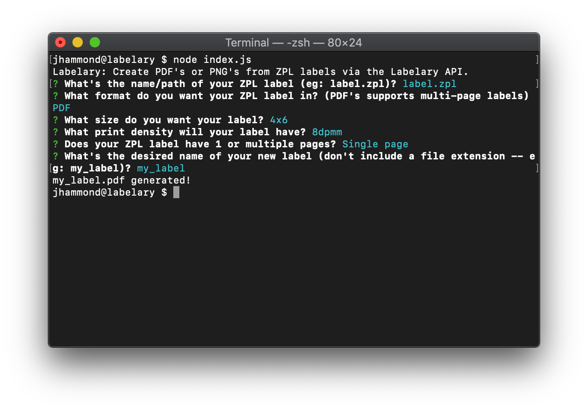

<div align="center">

# Labelary

Create PDF's or PNG's from ZPL labels via the [Labelary API](http://labelary.com/service.html).

[](https://travis-ci.com/justintime50/labelary)
[](https://opensource.org/licenses/mit-license.php)



</div>

When Labelary is run from a terminal, you'll be prompted for details on your label to be generated such as the path to your ZPL label, desired size, desired new label format, desired new label filename, etc. Once done, Labelary will take the ZPL details and build either a PDF or PNG based on your selection.

## Install

Install Labelary globally via NPM, use from anywhere:

```bash
npm i -g labelary
```

## Usage

```bash
# Convert a ZPL to PDF or PNG via the CLI
labelary
```

## Development

Install dependencies in the project directory:

```bash
npm i
```

Run linting:

```bash
npx eslint index.js
npx eslint lib/*
```

NOTE: This package uses `request` which is deprecated. This will need to be replaced soon.
